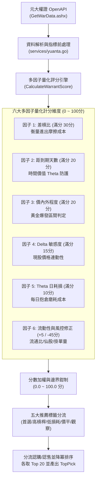

# 🎯 etfinfo_Go 權證多因子量化評分與推薦機制說明書

> **專案位置**：`etfinfo_Go`  
> **核心實作**：`services/warrant.go` (`CalculateWarrantScore` 函式)、`services/yuanta.go`  
> **資料來源**：元大權證 OpenAPI (`GetWarData.ashx`)、TWSE MIS 即時行情  
> **文件版本**：v1.0 (2026-09-23)

---

## 📌 一、 核心設計理念與架構

在台股權證市場中，投資人常面臨上百檔權證難以挑選的痛點，許多權證看似槓桿極高或價格極低，但實際上往往隱藏了**買賣價差巨大**、**時間價值 Theta 加速衰退**、**在外流通比過高導致造市失真**或**深價外連動遲鈍**等致命陷阱。

`etfinfo_Go` 建立了一套**以實戰摩擦成本為核心**的六維度多因子量化評分模型（滿分 100 分），將全市場流通的認購（Call）與認售（Put）權證進行全自動化洗價、多因子評分與分級標籤推薦，幫助投資人在毫秒內篩選出「**低成本、高爆發、抗衰退、好進出**」的極品權證。

---

## 🧮 二、 評分因子詳細權重與級距標準

模型總分為 **0.0 ～ 100.0 分**，依照實戰重要程度配置權重：

### 1. 因子 1：差槓比 (Spread-to-Leverage Ratio) — 權重 30 分【最關鍵指標】

* **定義與實戰意義**：
  權證挑選最致命的盲點是「只看槓桿，不看價差」。若一檔權證實質槓桿 5 倍，但買賣價差高達 5%，代表現股必須上漲 1% 權證才剛好打平進出手續費與滑價！
  **差槓比 = 買賣價差比 / 實質槓桿**，直接代表「**現股需上漲多少百分比，才能弭平權證買賣一檔的進出摩擦成本**」。數值越低，代表投資人勝率越高。

* **計算公式**：
  $$\text{買賣價差比 (\%)} = \frac{\text{委賣價} - \text{委買價}}{\text{委買價}} \times 100\%$$
  $$\text{實質槓桿} = \text{Delta} \times \frac{\text{標的現價}}{\text{權證價格}} \times \text{行使比例}$$
  $$\text{差槓比 (\%)} = \frac{\text{買賣價差比 (\%)}}{\text{實質槓桿}}$$

* **評分級距**：
  | 差槓比區間 | 得分 | 評價水準 | 說明 |
  | :--- | :---: | :--- | :--- |
  | $\le 0.20\%$ | **30 分** | 極致優質 | 現股僅需跳動 0.2% 即回本，摩擦極小 |
  | $0.20\% < \text{比值} \le 0.35\%$ | **26 分** | 優等水準 | 業界優質造市水準（高亮翠綠推薦） |
  | $0.35\% < \text{比值} \le 0.50\%$ | **20 分** | 良好水準 | 一般短線可接受範圍 |
  | $0.50\% < \text{比值} \le 0.80\%$ | **12 分** | 普通水準 | 摩擦偏大，適合較大波段 |
  | $0.80\% < \text{比值} \le 1.50\%$ | **5 分** | 成本偏高 | 滑價嚴重，不易獲利 |
  | $> 1.50\%$ 或異常 | **0 分** | 極差 | 買入即面臨嚴重虧損，嚴禁挑選 |

---

### 2. 因子 2：距到期天數 (Days to Expiry / Period) — 權重 20 分【時間價值防護】

* **定義與實戰意義**：
  權證為具備到期日的衍生性金融商品，其時間價值（Theta）並非線性流失，而是在**最後 30~60 天呈拋物線急墜歸零**。因此避開快到期權證是保命第一準則。

* **評分級距**：
  | 距到期天數區間 | 得分 | 說明 |
  | :--- | :---: | :--- |
  | $90 \sim 240$ 天 | **20 分** | **黃金蜜月期**：時間價值平緩，兼具高槓桿與耐震性 |
  | $60 \sim 90$ 天 | **15 分** | **尚可接受**：適合 1~2 週內快速了結之短線交易 |
  | $> 240$ 天 | **14 分** | **長天期**：時間極充裕，但槓桿乘數效應通常較低 |
  | $30 \sim 60$ 天 | **6 分** | **偏短天期**：時間價值加速蒸發，不適合留倉 |
  | $< 30$ 天 | **0 分** | **極度危險**：即將到期歸零陷阱，嚴禁交易 |

---

### 3. 因子 3：價內外程度 (Moneyness) — 權重 20 分【爆發力與勝率】

* **定義與實戰意義**：
  - **價外（Out-of-the-Money）**：槓桿較大，價格便宜，但若到期未履約會歸零。
  - **價內（In-the-Money）**：槓桿較小，價格昂貴，具備內含價值，不容易歸零。
  - 實戰黃金甜蜜點落在「**價外 3% ～ 價外 15%**」：此區間既擁有優質的槓桿爆發力，又因為只需標的微幅發動即有機會進入價內，避免成為廢紙。

* **計算公式**：
  $$\text{價內外 (\%)} = \frac{\text{現股現價} - \text{履約價}}{\text{履約價}} \times 100\% \quad (\text{負值為價外，正值為價內})$$

* **評分級距**：
  | 價內外程度 | 得分 | 說明 |
  | :--- | :---: | :--- |
  | 價外 $3\% \sim 15\%$ ($-15\% \le M \le -3\%$) | **20 分** | **黃金爆發區間**（高槓桿＋連動快） |
  | 價平區 (價外 $3\% \sim$ 價內 $5\%$) | **16 分** | **價平穩健**（連動性佳，適合穩健波段） |
  | 輕度深價外 (價外 $15\% \sim 25\%$) | **12 分** | 槓桿高但需標的具備極大動能 |
  | 價內 $5\% \sim 15\%$ | **10 分** | 安全性高但槓桿偏低 |
  | 深度價內或深價外 ($|M| > 25\%$) | **3 分** | 深價內失去槓桿意義；深價外連動幾乎死魚 |
  | 其他區間 | **8 分** | 基礎過渡分 |

---

### 4. 因子 4：Delta 敏感度係數 — 權重 15 分【現股連動能力】

* **定義與實戰意義**：
  Delta 代表標的股票每變動 1 元時，權證理論價格隨之變動的敏感幅度。
  - 認購權證 Delta 介於 $0 \sim +1$；認售權證 Delta 介於 $-1 \sim 0$。
  - 若 $|Delta| < 0.20$，股票大漲但權證幾乎不會動；若 $|Delta| > 0.80$，權證走勢幾乎等於現股，但失去選擇權槓桿特色且價格高昂。

* **評分級距（取絕對值 $|Delta|$）**：
  | $|Delta|$ 範圍 | 得分 | 說明 |
  | :--- | :---: | :--- |
  | $0.35 \le |Delta| \le 0.65$ | **15 分** | **最佳平衡區**：兼具連動敏銳度與槓桿效應 |
  | $0.20 \le |Delta| < 0.35$ 或 $0.65 < |Delta| \le 0.80$ | **10 分** | 次佳區間 |
  | $|Delta| > 0.80$ | **6 分** | 過度深價內，權證價格過高 |
  | $|Delta| < 0.20$ | **3 分** | 過度深價外，連動鈍化 |

---

### 5. 因子 5：Theta 每日時間耗損比例 — 權重 10 分【抱倉成本】

* **定義與實戰意義**：
  Theta 代表每抱倉一天，因時間流逝而蒸發的權證價格金額。為排除價格絕對金額高低的干擾，系統換算為「**每日耗損佔權證價格之百分比 (ThetaPct)**」。

* **計算公式**：
  $$\text{ThetaPct (\%)} = \frac{|\text{Theta 每日損耗金額 (元)}|}{\text{權證價格 (元)}} \times 100\%$$

* **評分級距**：
  | 每日損耗比例 | 得分 | 說明 |
  | :--- | :---: | :--- |
  | $\le 1.0\%$ | **10 分** | 每日磨耗極低，即使持倉一週也幾乎不受傷 |
  | $1.0\% \sim 2.0\%$ | **8 分** | 正常流失範圍 |
  | $2.0\% \sim 3.5\%$ | **5 分** | 損耗偏大，適合當日或隔日沖沖銷 |
  | $> 3.5\%$ | **2 分** | 時間價值劇烈流失，留倉風險極大 |

---

### 6. 因子 6：流動性造市與風控懲罰機制 (+5 / -45 分)【防黑心造市與仙股陷阱】

除了上述理論定價因子外，實盤交易最怕券商造市不良與無流動性陷阱，系統特別引入防呆懲罰與獎勵：

1. **在外流通比過高扣分（重扣 -20 分）**：
   - 當 `在外流通比 (OutVolumeRate) > 80%`，系統扣 20 分。
   - **背後邏輯**：當權證在外流通比超過 80%，代表券商庫存幾乎賣光，失去法定造市義務（不必再掛單賣出）。此時市場價格容易被散戶哄抬為「黑心溢價」，一旦標的回檔，價格常會斷崖式崩跌。
2. **仙股廢紙價格扣分（重扣 -25 分）**：
   - 當 `權證現價 (Price) < 0.20 元`，系統扣 25 分。
   - **背後邏輯**：在台股交易制度下，0.20 元以下的權證每跳一檔（0.01 元）就是 5% 以上的損益跳動，且買賣價差常被鎖死，極易淪為無法賣出變現的廢紙。
3. **造市掛單積極獎勵（加 +5 分）**：
   - 當 `委買掛單量 + 委賣掛單量 >= 200 張`，系統加 5 分。
   - **背後邏輯**：造市商掛單厚實，大額下單不容易滑價或打穿買賣五檔。

---

## 🏷️ 三、 推薦標籤分類邏輯 (Recommendation Tag)

每一檔權證計算出總分後，系統會結合其特性自動歸類為以下標籤：

| 推薦標籤 | 觸發條件判定規則 | 實戰投資應用建議 |
| :--- | :--- | :--- |
| **首選精選 ⭐** | 綜合評分 $\ge 80.0$ 分 | 各項指標均為市場頂尖，優先挑選之全方位極品權證。 |
| **高槓桿 ⚡** | 實質槓桿 $\ge 6.0\text{x}$ 且 綜合評分 $\ge 65.0$ 分 | 現股突破關鍵阻力、即將發動急攻時的短線追價利器。 |
| **低時間損耗 🛡️** | Theta 每日耗損 $\le 1.2\%$ 且 天數 $\ge 120$ 天 且 綜合評分 $\ge 60.0$ 分 | 適合中波段佈局，不怕盤整洗盤的時間耗損。 |
| **價平穩健 🎯** | 價內外絕對值 $\le 5.0\%$ 且 綜合評分 $\ge 60.0$ 分 | 現股連動率高，貼近現股漲跌幅，回檔具備防御性。 |
| **觀察中 ⚠️** | 綜合評分 $< 45.0$ 分 | 可能面臨快到期、深價外、仙股或價差過大，建議避開。 |
| **標準流通** | 未符合上述特殊規則但總分正常 | 普通流通標的。 |

---

## 🚀 四、 權證排序與資料導出流程

1. **分流排序**：
   - 認購（Call）與認售（Put）分開獨立排序。
   - 清單依 `Score` 降冪（由高到低）排序。
2. **TopPick 決選**：
   - 由認購與認售中第一名（得分最高者）選為該標的之 `TopPick`。
3. **快取與靜態打包**：
   - 前端限制各取前 20 檔最高分權證。
   - 伺服器支援自動導出靜態 JSON 快照（如 `data/warrants/2330.json`）與 `warrants_bundle.js`，支援離線 `file://` 與 Vercel Edge CDN 秒開。

---

## 💡 五、 實戰挑選權證四大黃金法則

1. **差槓比低於 0.3% 為首選**：差槓比越低，獲利越不會被券商買賣價差吃掉。
2. **絕不碰剩餘天數少於 60 天**：末日權證時間價值呈拋物線急墜，勝率極低。
3. **優選價外 3% ~ 15% 區間**：兼顧連動性與高槓桿乘數爆發力。
4. **避開在外流通比 > 80%**：券商籌碼耗盡容易引發黑心溢價，回檔跌勢兇猛。
