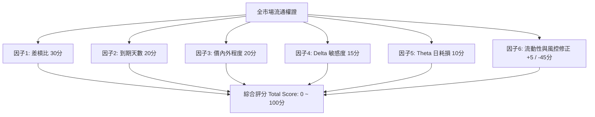

# 🎯 元大權證多因子量化推薦矩陣 — 欄位意義與評分模型技術說明

## 📖 系統概述
本系統整合**元大權證 OpenAPI** 與**台股即時量化模型**，針對個股標的所有全市場流通權證（認購 Call 與 認售 Put）進行全維度即時多因子量化篩選與評分推薦，旨在協助投資人從成百上千檔複雜衍生性金融商品中，以最低摩擦成本與最佳爆發力挑選出高性價比之極品權證。

---

## 📊 一、 各表格欄位意義與量化定義

| 欄位名稱 | 英文定義 | 計算公式 / 資料來源 | 實戰投資意義與判讀標準 |
|---|---|---|---|
| **推薦排名** | Rank | 依多因子量化綜合評分（降冪）排序之序號 | 全市場所有流通權證經過綜合評估後的排名順位（01, 02...）。 |
| **綜合評分** | Multi-Factor Score | 0.0 ~ 100.0 分（滿分 100 分） | **衡量權證綜合性價比之核心分數**。分數越高代表摩擦成本越低、槓桿爆發力越好、時間耗損越小且造市越積極。 |
| **權證代號** | Warrant Code | 6 碼權證代碼（如 `077492`） | 點擊可直通**富邦證券權證 K 線圖**，快速檢視歷史走勢與技術指標。 |
| **權證名稱** | Warrant Name | 發行商命名之權證簡稱（如 `億光群益61購01`） | 點擊可直通**元富證券權證詳細頁面**，檢視造市品質與各項希臘字母參數。 |
| **券商 / 履約價 / 行使比** | Issuer / Strike / Exercise Ratio | 發行券商、履約價格 (元)、行使比例 | **行使比例**：1 張權證可換購/售現股之股數（例如 0.22 代表 1 張權證表彰 220 股現股）。**履約價**：合約到期之結算約定價格。 |
| **推薦標籤** | Recommendation Tag | 依綜合得分與特性自動分類 | - `首選精選 ⭐`：綜合得分 ≥ 80 分，各項條件皆屬市場頂級。 - `低時間損耗 🛡️`：每日 Theta 耗損 ≤ 1.2% 且天數 ≥ 120 天，適合波段佈局。 - `高槓桿 ⚡`：實質槓桿 ≥ 6.0x 且得分 ≥ 65 分，適合短線突破追價。 - `價平穩健 🎯`：價內外 5% 以內且得分 ≥ 60 分，現股連動性佳。 - `觀察中 ⚠️`：得分 < 45 分，可能面臨深價外、天數不足或價差過大風險。 |
| **差槓比 (%)** | Spread-to-Leverage Ratio | `買賣價差比 (%) / 實質槓桿` | **🔥 權證挑選最關鍵之核心指標**。數值越低代表進出交易摩擦成本越低。**差槓比 < 0.3% 為極品黃金權證**（高亮翠綠），保證獲利不被券商價差吃掉。 |
| **實質槓桿** | Effective Leverage | `Delta * (現股現價 / 權證現價) * 行使比例` | 現股每上漲 1% 時，權證理論價格上漲的百分比倍數（例如 6.39x 代表現股漲 1%，權證漲 6.39%）。 |
| **價差比 (%)** | Spread Rate | `((委賣價 - 委買價) / 委買價) * 100%` | 造市商掛單一檔的買賣滑價摩擦空間，越小越容易即時成交在合理價。 |
| **到期天數** | Days to Expiry | 距離最後履約結算日的剩餘有效天數 | 建議挑選 **> 90 天**（時間價值流失平緩），**嚴禁碰 < 60 天**（時間價值呈拋物線加速歸零）。 |
| **價內外 (%)** | Moneyness | `((現股現價 - 履約價) / 履約價) * 100%` | **黃金爆發區間為「價外 3% ~ 價外 15%」**，兼具高槓桿爆發力與不易歸零特性。 |
| **Delta** | Delta Sensitivity | 選擇權定價模型之避險係數（認購 0~1，認售 -1~0） | 現股每跳動 1 元時權證理論跳動金額（已乘行使比率）。最佳區間介於 `0.35 ~ 0.65`。 |
| **日耗損 (%)** | Theta Loss Ratio | `(\|Theta 每日損耗元數\| / 權證現價) * 100%` | 每抱倉一天因時間流逝所損失的權證價值百分比。數值越小越好（建議 < 1.0%）。 |
| **權證現價 / 買賣價** | Warrant Price & Quotes | 即時成交價與最佳一檔委買 (Bid) / 委賣 (Ask) 價格 | 權證現價低於 0.20 元之「仙股」流動性風險極高，跳動一檔即造成劇烈虧損，系統會自動降評。 |
| **在外流通比 (%)** | Out Volume Rate | `(在外流通張數 / 總發行張數) * 100%` | 超過 80% 代表券商手中籌碼不足，容易失去造市紀律而產生黑心溢價，系統會予以扣分。 |
| **快捷連結** | External Links | Yahoo 股市即時報價、元大權證網分析頁面 | 一鍵快速切換至各大權威金融平台交叉檢驗。 |

---

## 🧮 二、 綜合分數 (0.0 ~ 100.0 分) 多因子量化計算基礎

系統依照六大維度對每一檔流通權證進行權重計分與防呆扣分修正：

### 1. 差槓比評分（權重滿分 30 分 — 摩擦成本指標）
- `差槓比 ≤ 0.20%`：**30 分**（極低摩擦成本，極致優質）
- `0.20% < 差槓比 ≤ 0.35%`：**26 分**（優等水準）
- `0.35% < 差槓比 ≤ 0.50%`：**20 分**（良好水準）
- `0.50% < 差槓比 ≤ 0.80%`：**12 分**（普通水準）
- `0.80% < 差槓比 ≤ 1.50%`：**5 分**（成本偏高）
- `差槓比 > 1.50%`：**0 分**（交易成本過高）

### 2. 距到期天數評分（權重滿分 20 分 — 時間價值防護）
- `90 天 ≤ 天數 ≤ 240 天`：**20 分**（黃金蜜月期）
- `60 天 ≤ 天數 < 90 天`：**15 分**（尚可接受）
- `天數 > 240 天`：**14 分**（長天期時間充足但槓桿稍低）
- `30 天 ≤ 天數 < 60 天`：**6 分**（偏短天期加速耗損）
- `天數 < 30 天`：**0 分**（即將到期歸零高危險區）

### 3. 價內外程度評分（權重滿分 20 分 — 爆發力與勝率）
- `價外 3% ~ 價外 15%`：**20 分**（黃金爆發區間）
- `價外 3% ~ 價內 5%`：**16 分**（價平穩健區間）
- `價外 15% ~ 價外 25%`：**12 分**（輕度深價外）
- `價內 5% ~ 價內 15%`：**10 分**（價內槓桿稍弱）
- `深價內 / 深價外 > 25%`：**3 分**

### 4. Delta 敏感度評分（權重滿分 15 分 — 現股連動能力）
- `0.35 ≤ |Delta| ≤ 0.65`：**15 分**（連動性與槓桿平衡最佳）
- `0.20 ≤ |Delta| < 0.35` 或 `0.65 < |Delta| ≤ 0.80`：**10 分**（次佳區間）
- `|Delta| > 0.80`：**6 分**（過度深價內，失去權證槓桿意義）
- `|Delta| < 0.20`：**3 分**（過度深價外，現股上漲權證不動）

### 5. Theta 每日時間耗損評分（權重滿分 10 分 — 抱倉成本）
- `日耗損 ≤ 1.0%`：**10 分**（每日耗損微乎其微）
- `1.0% < 日耗損 ≤ 2.0%`：**8 分**（正常流失範圍）
- `2.0% < 日耗損 ≤ 3.5%`：**5 分**（耗損偏大）
- `日耗損 > 3.5%`：**2 分**（時間價值流失過快）

### 6. 流動性造市與風控懲罰機制 (+5 / -45 分)
- **在外流通比懲罰**：若 `流通比 > 80%`，**重扣 20 分**（防範券商籌碼斷貨黑心溢價）。
- **仙股價格懲罰**：若 `權證現價 < 0.20 元`，**重扣 25 分**（防範跳檔價差過大之廢紙權證）。
- **造市積極獎勵**：若 `委買量 + 委賣量 ≥ 200 張`，**加 5 分**（確保進出流暢不卡單）。

---

## 🛡️ 三、 權證實戰操作黃金法則
1. **差槓比低於 0.3% 為王**：進出摩擦成本最低，即使盤整出場也不會重傷本金。
2. **絕不碰剩餘天數少於 60 天**：時間價值 Theta 呈現指數級加速衰退，勝率極低。
3. **優先挑選價外 3% ~ 15%**：此區間權證敏感度佳且具備最高實質槓桿乘數效應。
4. **避開在外流通比高於 80% 標的**：券商造市責任終止，容易買到虛胖的假高價。
